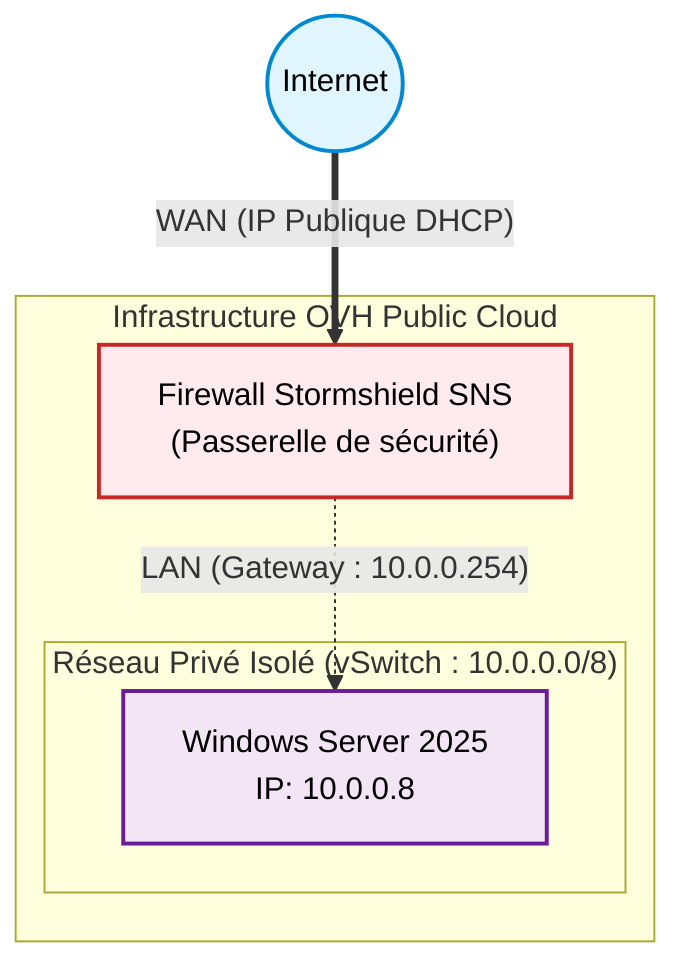

# Déploiement d'une Infrastructure Sécurisée (SNS) sur Cloud Public

  
  
  
  
  

## À propos du projet

Ce repo documente la mise en place d'une architecture réseau sécurisée sur **OVH Public Cloud**. L'objectif est de déployer une appliance **Stormshield Network Security (SNS)** agissant comme passerelle de sécurité pour un réseau privé (LAN) isolé contenant des serveurs critiques.

Le projet détaille l'installation, la configuration des interfaces réseaux en ligne de commande (CLI) et l'intégration d'un client Windows Server.

## Architecture Réseau

Le réseau est segmenté en deux zones distinctes :

* **WAN (Zone Publique)** : Connectée à Internet via le réseau public OVH.
* **LAN (Zone Privée)** : Réseau isolé `10.0.0.0/8`, non accessible depuis l'extérieur sans passer par le Firewall.

| Rôle | OS | Interface WAN | Interface LAN |
| :--- | :--- | :--- | :--- |
| **Firewall / Gateway** | Stormshield SNS (EVA) | DHCP (Public) | `10.0.0.254` |
| **Serveur App** | Windows Server 2025 | *Aucune* | `10.0.0.8` |

## Fonctionnalités implémentées

* [x] Création du vSwitch privé sur OpenStack (OVH).
* [x] Déploiement de l'instance Stormshield via image Cloud.
* [x] Configuration bas niveau (Shell FreeBSD) des interfaces réseaux.
* [x] Configuration statique du client Windows Server.
* [x] Validation des flux ICMP et accès WebAdmin sécurisé.

## Schéma 

## Documentation

[Guide de déploiement complet](./Guide_deploiement.md)
